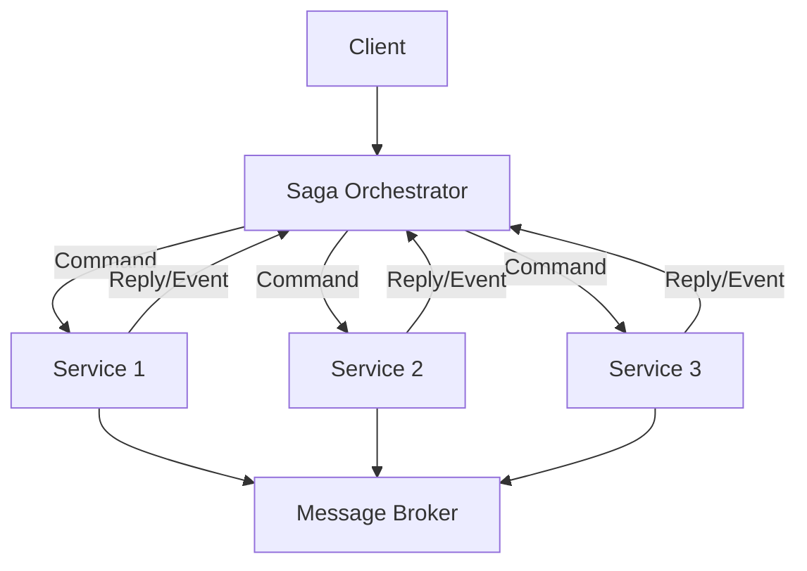
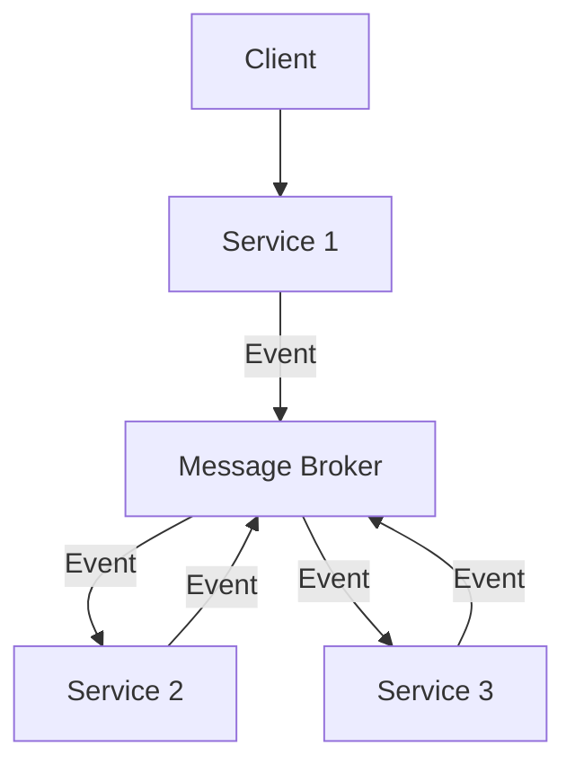

# saga_pattern

Implementation of the saga pattern for learning purposes. The saga pattern can be implemented either orchestration-based or a choreography-based. 
So far i did not implement the choreography-based version. My implementation is based on the descriptions in Microservices Patterns (Chris Richardson, ISBN 9781617294549). I do not use the Eventuate Tram Sagas Framework ([1]) but rather try to implement the described logic myself.

## Saga Orchestration

Properties:
- Saga Orchestrator (Orchestration): A centralized controller that manages the saga flow, triggers local transactions, and handles compensations.
- Local Transactions: Each service performs its own database updates and publishes events (transaction outbox pattern).
- Compensating Transactions: If a step fails, compensating transactions are executed in reverse order to undo previous changes.
- Message Broker: Facilitates asynchronous communication between services (here RabbitMQ).

## Saga Choreography
The propably most interesting part is in my opinion the (definition of the Create Order Saga)[https://github.com/Oli2861/Saga_Pattern/blob/main/orchestration/app/order_service/src/main/kotlin/com/oli/saga/CreateOrderSagaDefinition.kt].

Properties:
- Decentralized Control: No central orchestrator. Each service autonomously handles domain events & decides whether to execute a local transaction and emit subsequent events.
- Event-Driven: Services communicate via events published to the message broker (e.g., RabbitMQ). Event consumption triggers the next step in the saga.
- Implicit Workflow Definition: The saga flow is not explicitly modeled in a single component. Instead, the overall process is modeled as a chain of event handlers across services.
- Local Transactions: Each service performs its own database updates and publishes events (transaction outbox pattern).
- Compensating Transactions: If a step fails, compensating transactions are executed as a reaction to a compensation event in reverse order to undo previous changes.

## TODO
### Orchestration-based
- Implement alternative version that uses RabbitMQ channels rather than RabbitMQ RPC calls and persist the saga states whenever a remote procedure call is made.
- Prevent infinite retries if a service is not available --> Look into circuit breaker pattern / exponential backoff
- Upgrade to postgres 15
[1]:https://github.com/eventuate-tram/eventuate-tram-sagas
